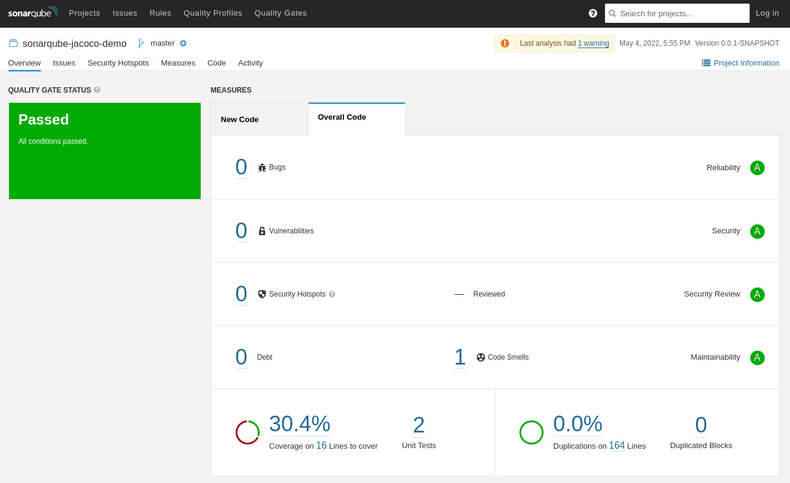

# SonarQube JaCoCo Demo
Sample project that demonstrates how to measure code coverage and generate a report using SonarQube and JaCoCo

## How to run
1. Run SonarQube: `docker-compose up`
2. Build the project: `mvn clean install`
3. Analyze the project: `mvn sonar:sonar`
4. Check SonarQube report at [http://locahost:9000](http://localhost:9000) (default login - *admin/admin*)

